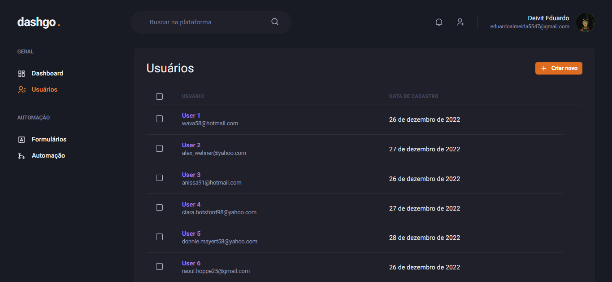

<p align="center">
  
</p>

<h4 align="center"><a href="https://dashgo-sampaiocode.vercel.app">Clique para visitar o projeto</a></h4>

---

## 💻 Sobre o projeto

Projeto desenvolvido durante o Chapter IV da trilha ReactJS - Ignite da Rocketseat. O projeto que consiste em um dashboard, construído usando completamente o Chakra UI.

## 🛠️ Tecnologias

Este projeto foi desenvolvido utilizando as seguintes tecnologias:

- [ReactJS](https://reactjs.org/)
- [Next.js](https://nextjs.org/)
- [TypeScript](https://www.typescriptlang.org/)
- [Chakra UI](https://chakra-ui.com/)
- [Mirage JS](https://miragejs.com/)
- [React Hook Form](https://react-hook-form.com/)
- [React Query](https://react-query-v3.tanstack.com/)
- [Yup](https://github.com/jquense/yup)

## 🚀 Instalação

**Clone o projeto**

```bash
git clone https://github.com/sampaiocode/ignews.git
```

**Siga os passos abaixo**

```bash
# Acesse a pasta
$ cd dashgo

# Instale as dependências
$ yarn

# Inicie a aplicação
$ yarn dev
```

## 📝 Licença

Esse projeto está sob licença. Veja o arquivo [LICENÇA](LICENSE) para mais detalhes.

---

Desenvolvido com 💙 por [Deivit Eduardo](https://github.com/sampaiocode)
